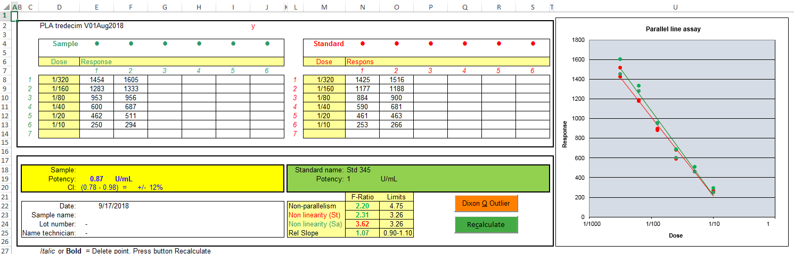
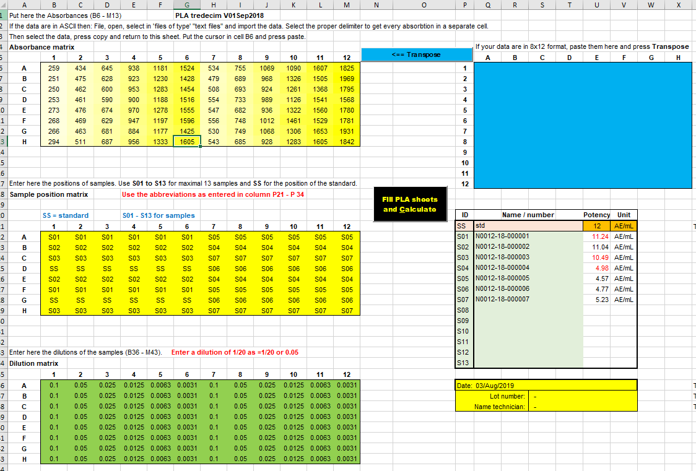
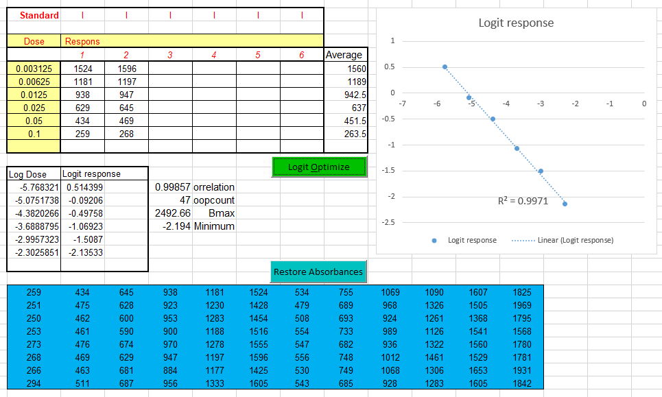
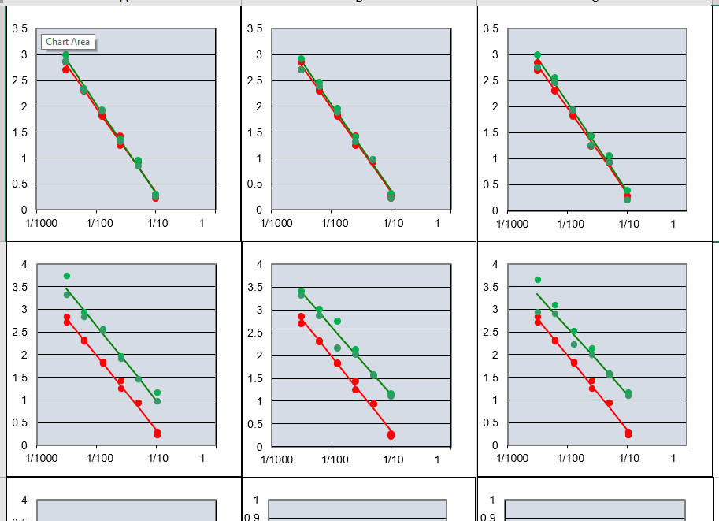
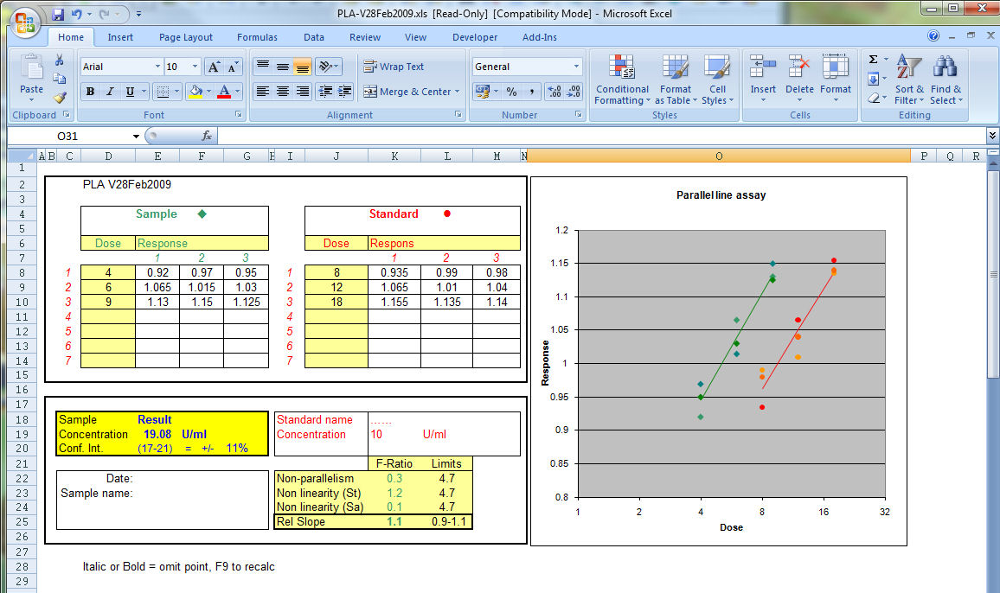

# PLA_tredecim
 PLA in Excel for 13 samples

See also here: https://ednieuw.home.xs4all.nl/Calibration/PLA/PLA.htm

<h2 class="style1">Parallel line assay, PLA in Microsoft Excel </h2>

<table width="1034" cellspacing="0">
  <tr>
    <td width="452" valign="top" class="style1">
This PLA (parallel line assay) calculation method is programmed in Microsoft Excel. 
        
      
The program is designed to calculate up to thirteen potencies from data measured in a 8 by 12 ELISA format or from linear lists with data. Results are grouped per sample on thirteen separated sheets or grouped together in one sheet. Depending on the calculated statistics results are flagged with a colour to identify results with statistical results out of specification. 

      
The PLA calculation method followed was described by Finney and is designed for the so called dilutions assays. The measured response of a dilution of a test sample is compared with the response of the same dilution of a standard. By means of analysis of variance a F-test is calculated and used to validate the calculated potency of the test sample.

    </td>
    <td width="471" valign="top" class="style1">
Deze PLA (parallel line assay) rekenmethode is in Microsoft Excel-worksheet geprogrammeerd. 
        
      
Deze applicatie leest ELISA-plaatbestanden in en vult, tot dertien monsters, per monster een PLA-tabblad met gegevens. De resultaten van deze dertien tabbladen worden gegroepeerd in een tabel en voorzien van een kleur, afhankelijk of de statistiek binnen of buiten specificaties valt. 

      
Deze PLA-rekenmethode is beschreven door Finney en wordt toegepast in 'dilution assays'. 
  Bij deze bepalingen wordt de respons gemeten per verdunning van een test monster en vergeleken met de respons van dezelfde verdunningen van standaard. Door middel van een variantieanalyse wordt aan de hand van F-toetsen en betrouwbaarheid van de berekende potency de validiteit van het resultaat getoetst. 
</td>
  </tr>
</table>

View the manual in English and Dutch or download as <a href="Manual_PLA_Tredecim_V01Sep2018_in_Excel.docx">DOCX</a> or as <a href="Manual_PLA_Tredecim_V01Sep2018_in_Excel.pdf">PDF</a> 

<a href="PLA%20tredecim%20V01Sep2018.xlsm">Download the &quot;PLA Tredecim V01Sep2018&quot;</a>program 

<a href="PLA%20tredecim%20V01Sep2018.xlsm">Download the &quot;PLA Tredecim V01Sep2018&quot; test </a>program filled with data to play with. 

Raw data and results are grouped together. 
   

With a logit transformation of the dose-responses of the standard it is possible to extend the measuring range  
or make sigmoid curves linear.

All thirteen graphs together in one sheet. 
   

Reference: David J. Finney,	Statistical Method in biological assay, Third edition 1978

&nbsp;

Below the 2009 version single sample program. 
<a href="PLA-V28Feb2009.zip">Download PLA_V28Feb2009</a> in Microsoft Excel

<a href="../Regression.htm">&lt;-- Back to calibration programs</a>

<a href="../../email.html">Ed Nieuwenhuys</a>, 13 august 2019 

&nbsp;

